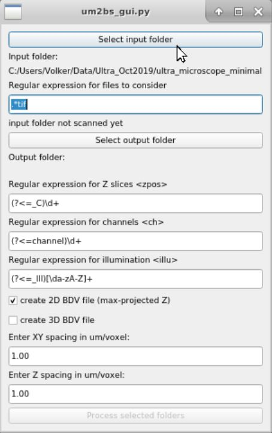
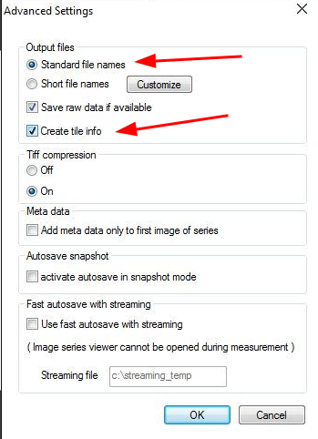

# UM2BS -- Convert Ultramicroscope acquistions to Big Stitcher projects



## About

`um2bs_gui` is a Python app that allows converting microscopy image files acquired with the Lavision BioTec Ultramicroscope to Big Stichter compatible Big Data viewer files. The stage positions in the files `Tiles.txt` are used to place the individual
stacks in their correct position.


## Simple Installation & Start

In a clean Python environment (this has been tested with Python 3.6 and 3.7.) use 
the following command for installation:

```
python -m pip install git+https://github.com/VolkerH/Ultramicroscope2BigStitcher
```

If everything goes well, you should now be able to launch the application from the commandline by typing

```
um2bs_gui
```


## Alternative Installation with environment


If for some reason the simple installation above fails you can set up a conda environment.
Create a python environment using `conda` and install dependencies (only needed once.)

* Install anaconda/miniconda
* Start a terminal or cmd window
* Create a new conda environment `conda create -n um2bs python=3.6`
* Activate the environment `conda activate um2bs`
* `conda install -c conda-forge scikit-image pandas tifffile pyqt h5py xmltodict`
* `pip install npy2bdv`

Startup

* activate the conda environment `conda activate um2bs`
* in the `um2bs` folder execute `python um2bs_gui.py`

## Ultramicroscope: acquistion, file names etc. 

* The `um2bs` tool does not support the slide book file format. You need to set up your tile scan in a way that the files are written as `tif` files.
* File name structure. I only had a limited number of datasets for testing. However, from what I observed the file naming of the Ultramicroscope software is very inconsistent (some might say it is broken). Depending on the options that are chosen during acquisition (multi channel vs single channel, number of illumination directions, etc.) sometimes the channel number in the filename refers to the Z slice or the channel could actually be encoded in the illumination direction.
* The folder with the images should also contain a file called `tiles.txt`. This file contains the stage positions.
* I could not find any metadata about physical dimensions of the pixel spacing in XY or the spacing between Z planes. It is thus important that you note down these values
somewhere.

Make sure you generate the tile information during acquisition:

1. Go to `Autosave settings`
1. Go to `Advanced settings`
1. In the dialog, select `Create Tile Info`
1. You may have to rename the tile info file to `tiles.txt` and place it into the folder with the images manually. 


## Usage

* Start the program as described above under Installation & Start.
* Set a regular expression that filters the files that you want to consider, e.g. `.*.tif` to consider files ending in `.tif`. You can use are more restrictive regular expression to limit the processing to files of a particular channel or illumination direction.
* Select the output folder in which the Big Stitcher projects are to be written. This folder should be empty.
* The next three field should be regular expressions that are used to extract relevant information from the filename. As mentioned above, the file naming seems to vary depending on the selected acquisition settings and I have not seen enough datasets to auto-detect all of the possible combinations. To keep the software flexible, the user must supply the regular expressions. In most cases you should be able to copy & paste some of the regular expressions below.
* Select the input folder. The input folder will be searched for files and the regular expressions will be applied to filter the files and to extract the metadata.
* Select whether you want to create stitching projects for 2D files (based on projections of stacks) or 3D files or both.
* Set the scale in um/pixel and um/z-slice (which you should have noted down during acquistion.)
* Once everything is set, you can start the processing.

## Regular expressions

If you are not familiar with python regular expressions, you can get started by copying and pasting some of the examples below. The best resource for experimenting with regular expressions is [regex101.com.](https://regex101.com). If you click on the examples below they will take you to the regex101 page.

Filtering files:
* to consider all files ending in tif: [`.*.tif`](https://regex101.com/r/mP31CL/1)

Extracting Metadata:
* To find the illumination direction, extract the character following Ill: [`(?<=_Ill)[\da-zA-Z]+`](https://regex101.com/r/sk8w3u/1/) . This will typically be _Left_ or _Right_. Added: I recently found out that sometimes the filenames don't contain `Ill`. In this case just try to match something else that is present and identical in each filename. 
* look for the character sequence `_C` and extract the numbers following it: 
[`(?<=_C)\d+`](https://regex101.com/r/HGR2iZ/1)

## Caveats

* At the time of this writing, this code has only been tested on a few datasets.
* Input checking and error handling is very limited. If you run into issues check the output on the console.
* It is assumed that enough RAM (and or swap space) is available to hold a whole volume tile in memory. Out-of-core processing for extremely large tiles (or very limited RAM) could be added using `dask_image`.
* No progress bar. Monitor progress by looking at the console output.

## Related Projects

I wrote a similar tool for creating Big Stitcher projects from Leica Matrix Screener acquistions which can be found [here](https://github.com/VolkerH/LeicaMatrixScreener2BigStitcher).

## Acknowledgements / Citation

* [Monash Micro Imaging](https://www.monash.edu/researchinfrastructure/mmi)
* I would like to thank my colleague Dr. Oleksandr Chernyavskiy from Monash Micro Imaging for providing sample data sets and Dr. Jesse Di Cello for valuable user feedback.
* This tool leverages prior efforts by Talley Lambert and Nikita Valdimirov, namely [imarispy](https://github.com/tlambert03/imarispy) and [npy2bdv](https://github.com/nvladimus/npy2bdv) [](https://doi.org/10.5281/zenodo.3971783
). 
* [Big Stitcher from the Preibisch Lab](https://www.nature.com/articles/s41592-019-0501-0)
